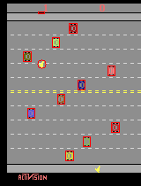
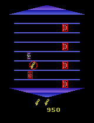

# Parsing Atari game frames from ALE

Parses input RGB image from ALE to state dictionary, using predefined object groups.

Currently includes parsing functions for Freeway and Asterix in parse.py.  
Use function in visualize.py to see parsed state.

Dependencies: cv2; numpy

Games
-
- Freeway: 
    - Groups: agent; car; dest(ination)
    - Templates needed: freeway_center_line.png
    - Sample parsed state: 
    
    
- Asterix: 
    - Groups: agent; target (rewarding objects); demon (punishing objects)
    - templates needed: everything in asterix_templ/
    - Sample parsed state: 
    
    
See docstring for details.
